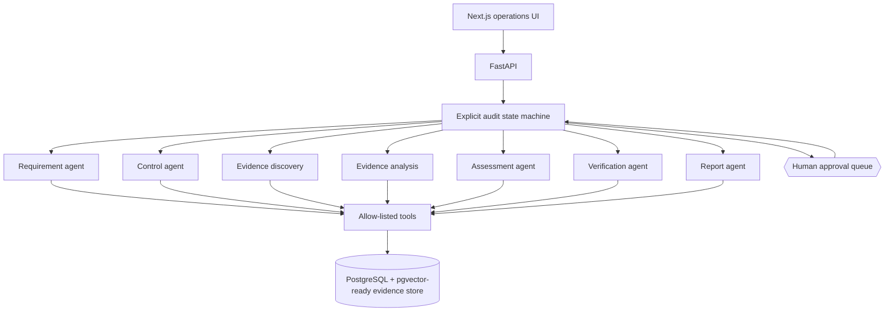
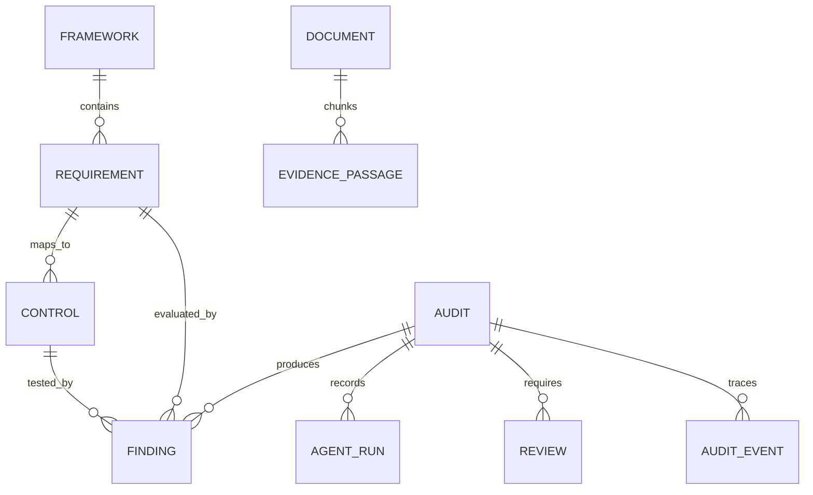

# Architecture

## Design principles

The orchestration is ordinary Python in `backend/app/workflow.py`. Agents propose typed artifacts; the workflow owns state, persistence, permissions, retries, and gates. This keeps control flow reviewable and prevents a framework from becoming the architecture.

## State machine

`DRAFT → EXTRACTING_REQUIREMENTS → AWAITING_REQUIREMENT_REVIEW → MAPPING_CONTROLS → DISCOVERING_EVIDENCE → ANALYZING_EVIDENCE → ASSESSING → VERIFYING → AWAITING_FINDING_REVIEW → REPORT_READY`

Only declared transitions are accepted. A failure enters `FAILED`; a reviewer must resolve all items before either pause can resume.

## Context engineering

Agents receive the smallest context needed for one decision: one requirement, one control, or a limited set of passages. Retrieval returns passage IDs and source locators. Prompts label all document content as untrusted. Reports receive approved finding summaries rather than entire source documents.

## Data lineage

Finding citations snapshot passage identifiers, document identifiers, locators, and concise quotes. `AgentRun` records model and tool calls. `Review` never overwrites the AI recommendation; modifications are separately attributable.

## Provider strategy

`agents/providers.py` defines one structured JSON interface. Gemini uses native response schemas. Ollama receives the same JSON schema. A deterministic rules provider path powers tests and the zero-cost demo. Provider output is always revalidated through Pydantic before persistence.

## Retrieval

The demo creates deterministic 64-dimensional local embeddings and combines cosine similarity with lexical overlap. PostgreSQL queries the `pgvector` column; SQLite computes cosine similarity in-process for local tests. A production embedding provider and HNSW index can replace the local embedding function without changing workflow or agent contracts.
