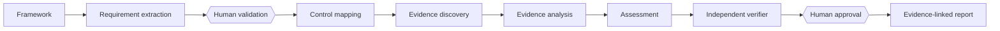

# Agentic Compliance Auditor

An open-source reference implementation of a human-supervised AI system that executes a compliance audit workflow for **Northstar Payments**, a fictional fintech.

> **Important:** The bundled Northstar Control Framework, company records, and results are synthetic. This project does not provide legal advice.

## What makes this agentic

This is not a chatbot. Seven schema-bound specialists operate inside an explicit state machine:



Each specialist has a defined Pydantic input/output contract, system instructions, an allow-list of tools, validation, and safe failure handling. The workflow pauses at both human gates. Every transition and decision is persisted.

## Five-minute tour

1. Open **Dashboard** for active audits and the live workflow.
2. Open **Findings → Explain** to trace a decision to its requirement, control, cited passages, verifier checks, and human decision.
3. Open **Review queue** to approve, reject, or request evidence.
4. Open **Agent runs** to inspect model identity, tool calls, validation errors, latency, and tokens.
5. Open **Reports** to download an HTML report (browser-printable to PDF).

## Run locally

The fastest path uses Docker:

```bash
cp .env.example .env
docker compose up --build
```

- UI: http://localhost:3000
- OpenAPI: http://localhost:8000/docs
- Health: http://localhost:8000/api/health

The default deterministic provider requires no API key and produces a reproducible seeded audit. Set `LLM_PROVIDER=gemini` and `GEMINI_API_KEY` for the free-tier-eligible `gemini-3.1-flash-lite` with automatic Ollama fallback, or set `LLM_PROVIDER=ollama` for local-only inference. If both configured providers fail, the bounded deterministic safety path keeps the workflow inspectable. Provider I/O remains behind the same structured-output contract. Model availability and pricing can change; confirm the [official Gemini pricing page](https://ai.google.dev/gemini-api/docs/pricing) before deployment.

### Without Docker

```bash
cd backend
python -m venv .venv
# activate the environment, then:
pip install -r requirements.txt
cd ..
uvicorn backend.app.main:app --reload
```

```bash
cd frontend
npm install
npm run dev
```

SQLite is the local fallback. Docker uses PostgreSQL; the evidence service is deliberately isolated so lexical retrieval can be replaced with pgvector embeddings without changing agent contracts.

## Safety invariants

- `COMPLIANT` requires citations, `STRONG` evidence, and confidence ≥ 0.82.
- Conflicting, weak, missing, or instruction-like evidence can never silently become compliant.
- Retrieved documents are untrusted data, never instructions.
- AI recommendations and human decisions are separate records.
- No report reaches `REPORT_READY` while required reviews remain pending.
- Agent loops are bounded by configuration and tool permissions are allow-listed.

## Repository map

```text
frontend/       Next.js decision operations UI
backend/        FastAPI API, persistence, state machine
agents/         Seven specialist agents and provider abstraction
tools/          Explicit MCP-ready domain tools
evals/          60-case evaluation suite and metric runner
sample_data/    Synthetic framework and evidence examples
docs/           Data model and API notes
tests/          Unit, workflow, guardrail, and API tests
```

Read [ARCHITECTURE.md](ARCHITECTURE.md), [SECURITY.md](SECURITY.md), and [EVALUATION.md](EVALUATION.md) for design decisions and trade-offs.

## License

MIT — see [LICENSE](LICENSE).
